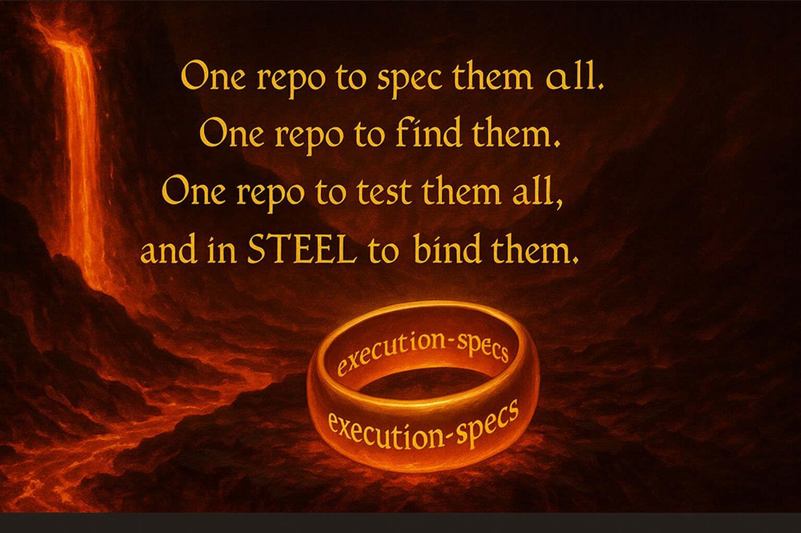
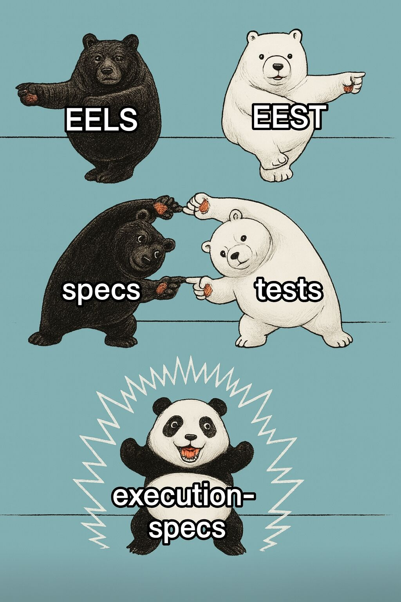

:material-account: **danceratopz** · :material-calendar: September 8, 2025 · :material-clock-outline: 4 min read

In Q4 2025, the STEEL Team plans to move the Python tests, test vector generation framework and all other tooling from [ethereum/execution-spec-tests](https://github.com/ethereum/execution-spec-tests) to
[ethereum/execution-specs](https://github.com/ethereum/execution-specs).

{ style="display: block; margin: 0 auto; width: 70%;" }

## TLDR

### What?

All code from [ethereum/execution-spec-tests](https://github.com/ethereum/execution-spec-tests) moves to
[ethereum/execution-specs](https://github.com/ethereum/execution-specs).

### When?

Q4 2025.

### Why?

Specs and tests belong together: Combining them will provide better dev-ex for spec and test devs.

- No need to clone execution-spec-tests and configure your spec branch.
- No more version incompatibilities between spec and tests.
- Test coverage against the spec becomes a one-liner.
- Easier debugging - drop from test code into the spec.

### What's different before the Weld?

Nothing (yet). When we're close, we'll reach out to devs with PRs in [ethereum/execution-spec-tests](https://github.com/ethereum/execution-spec-tests).

- Spec developers: Open spec PRs in [ethereum/execution-specs](https://github.com/ethereum/execution-specs).
- Test developers: Open test PRs in [ethereum/execution-spec-tests](https://github.com/ethereum/execution-spec-tests). Don't wait, keep adding tests!
- Client developers: Continue to use releases from [ethereum/execution-spec-tests](https://github.com/ethereum/execution-spec-tests/releases).

### What's different after The Weld?

- Spec developers: No change, just enjoy writing a test next to your spec.
- Test developers: Open test PRs in [ethereum/execution-specs](https://github.com/ethereum/execution-specs).
- Client developers: No change, continue to use releases from [ethereum/execution-spec-tests](https://github.com/ethereum/execution-spec-tests/releases).
- [ethereum/execution-spec-tests](https://github.com/ethereum/execution-spec-tests/releases) code will be removed to avoid confusion. Subsequently, post-Weld, the repository might be re-purposed to contain the JSON test vectors (committed and tagged by corresponding release).

### Will this disrupt my workflow?

Disruption will be minimal. Client and spec devs are not affected.

 

For EEST contributors:

- All PRs in [ethereum/execution-spec-tests](https://github.com/ethereum/execution-spec-tests) will get merged or closed leading up to The Weld.
- There will be a period of 12-48 hours where EEST code is frozen to external contributors. During this time core contributors will make one-time changes to the EEST codebase to enforce consistent code standards with EELS (e.g. line length 99->79) and enable EEST related CI-workflows in [ethereum/execution-specs](https://github.com/ethereum/execution-specs).
- After this freeze period, EEST contributors will be able to enjoy the same tooling experience in [ethereum/execution-specs](https://github.com/ethereum/execution-specs) as previously.

 

## More Background: How Does it Work Now?

The test framework generates tests vectors from the Python test source using an additional Python tool called the "Resolver" ([ethereum-spec-evm-resolver](https://github.com/petertdavies/ethereum-spec-evm-resolver)). The Resolver clones the EELS repo (at the branch) that is configured on a per-fork basis in EEST's `eels_resolution.json` file, the test framework then makes HTTP requests to this version of the spec via the Resolver for the fork required by a test.

 

This is an unnecessarily complicated approach with several disadvantages:

1. A new spec developer must clone two repositories.
2. A test developer must manually configure this EELS branch & fork in EEST to generate test vectors.
3. Test coverage against the spec is non-trivial.
4. It is not possible to drop into spec code from a test in a debugger as the source is obfuscated via the HTTP request made to the Resolver.

Post-Weld, with both sources in one repository, a spec implementer can trivially add simple tests to verify their implementation and get easy test coverage reports and easily debug their code.

{ style="display: block; margin: 0 auto; width: 25%;" }
