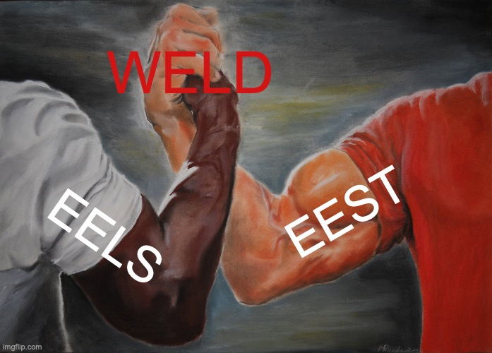
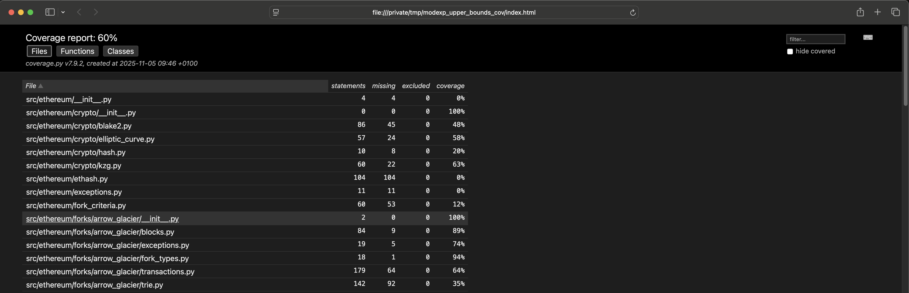

<div class="blog-metadata" markdown>
:material-account: **Guruprasad Kamath** · :material-calendar: November 4, 2025 · :material-clock-outline: 6 min read
</div>

{ style="display: block; margin: 0 auto; width: 70%;" }

We're excited to announce that **The Weld is complete!** The [ethereum/execution-spec-tests](https://github.com/ethereum/execution-spec-tests) repository has been successfully merged into [ethereum/execution-specs](https://github.com/ethereum/execution-specs), and we're now accepting contributions in the unified repository.

## What Was The Weld?

As we announced in our [September post](2025-09-11_weld-announcement.md), the Weld was our initiative to combine the Python execution specs (EELS) and the execution spec tests (EEST) into a single repository. This unification brings the Ethereum specification and its test framework together in one place.

## Why Did We Do This?

The separation of specs and tests across two repositories created unnecessary complexity:

1. **Multiple repository management**: New spec developers had to clone and manage two separate repositories.
2. **Manual configuration overhead**: Test developers needed to manually configure the EELS branch and fork in EEST to generate test vectors.
3. **Complicated test coverage**: Getting test coverage against the spec was non-trivial.
4. **Debugging difficulties**: It wasn't possible to drop into spec code from a test in a debugger, as the source was obfuscated via HTTP requests to the Resolver.

By combining these repositories, we've eliminated these pain points and created a streamlined development experience.

## What's Changed?

### For Spec Developers

- **Before:** Spec PRs in [ethereum/execution-specs](https://github.com/ethereum/execution-specs).<br/>
- **After:** Same workflow, but now you can easily write tests alongside your spec!

### For Test Developers

#### PRs

- **Before:** Test and test framework PRs targeted the [ethereum/execution-spec-tests](https://github.com/ethereum/execution-spec-tests) `main` branch.<br/>
- **After:** Test and test framework PRs should target the appropriate [ethereum/execution-specs](https://github.com/ethereum/execution-specs) fork or EIP branch, e.g., `forks/osaka`, `forks/amsterdam` or `eips/amsterdam/eip-7928`.

#### Config

- **Before:** The EELS branch defining the reference EVM had to be configured in `eels_resolutions.json`.
- **After:** No configuration is required, the EELS reference EVM implementation in the current branch is used out of the box.

#### Tooling: Development Setup

Initialization of the developer environment has been streamlined:

- **Before:** `uv sync --all-extras`.
- **After:** `uv sync` (still in the repo root directory).

#### Tooling: Spec Line Coverage

Basic line coverage of the Python specs (EELS) can be easily generated from the `fill` command, for example, for [EIP-7823: Set upper bounds for MODEXP](https://eips.ethereum.org/EIPS/eip-7823):

```bash
uv run fill --fork=Osaka --clean \
    tests/osaka/eip7823_modexp_upper_bounds/ \
    --cov=src/ethereum \
    --cov-report=html:/tmp/modexp_upper_bounds_cov
```

The relevant coverage can be browsed from `/tmp/modexp_upper_bounds_cov/index.html`.

{ style="display: block; margin: 0 auto; width: 70%;" }

#### Test Code

1. The line length of test and test framework source was previously 99; post-Weld it is 79 for consistency with the specs (EELS). This can still be applied via `uv run ruff format tests/`, for example.
2. The layout and packaging of the test framework libraries has been improved. Commonly used objects can now be directly importing from the top-level `execution_testing` package. For example:

    - **Before:**

        ```python
        from ethereum_test_checklists import EIPChecklist
        from ethereum_test_forks import Fork
        from ethereum_test_tools import (
            Account,
            Alloc,
            Block,
            BlockchainTestFiller,
            Transaction,
            TransactionException,
        )
        from ethereum_test_vm import Opcodes as Op
        ```

    - **After:**

        ```python
        from execution_testing import (
            Account,
            Alloc,
            Block,
            BlockchainTestFiller,
            EIPChecklist,
            Fork,
            Op,
            Transaction,
            TransactionException,
        )
        ```

### For Client Developers

**Before:** Releases from [ethereum/execution-spec-tests](https://github.com/ethereum/execution-spec-tests/releases).<br/>
**After:** No change - continue using the same release location.

## What's Next for STEEL with respect to the WELD?

The STEEL team is now focused on creating a more **native integration** between the spec and test codebases.

Our roadmap includes:

- **Shared type systems**: Unifying the type definitions used across specs and tests to eliminate redundancy and improve consistency.
- **Common abstractions**: Creating shared utility functions and abstractions that both specs and tests can leverage.
- **Tighter coupling**: Enabling tests to directly import and use spec types and functions, rather than interfacing through intermediate layers.
- **Improved developer ergonomics**: Streamlining the workflow further so that writing a test that validates a spec change feels completely natural.

These improvements will build on the foundation laid by the weld, making the unified repository not just a collection of code in one place, but a truly integrated development environment for Ethereum execution layer specifications and testing.

These steps are an ongoing process and will be implemented incrementally over time. We'll continue to refine and improve the integration as we learn from the community and discover new opportunities for optimization.

## We're Open for Business

The weld process is complete, and the unified repository is fully operational. **We're ready to accept contributions again!**

## Thank You

We appreciate the patience of our community during the weld process. The temporary freeze was necessary to ensure a smooth transition, and we believe the improved developer experience will be well worth it.

<br/>

Happy contributing!!!

<br/>

---

*For more details on the weld and what changed under the hood, see our [original announcement post](2025-09-11_weld-announcement.md).*
