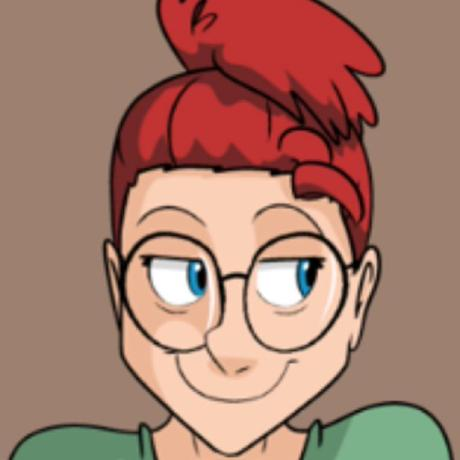
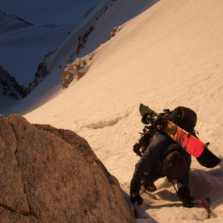
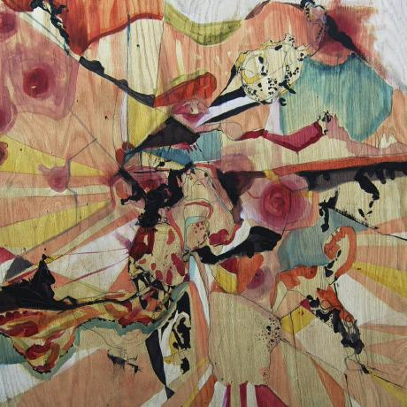
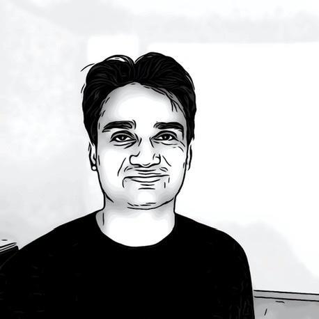
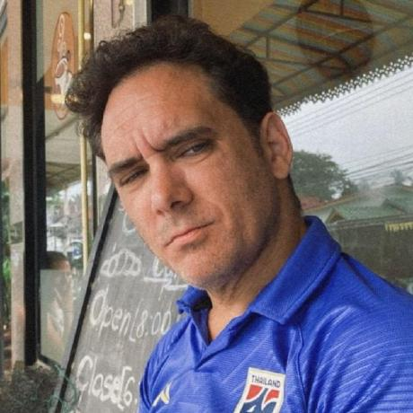
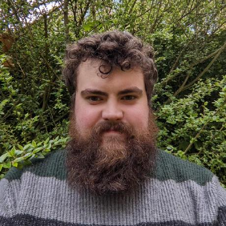
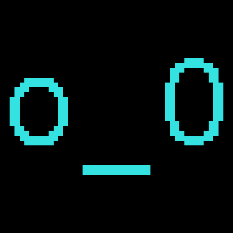

- { .team-avatar }

    ### **Mario Vega**

    Team Lead, Protocol Tester.

    [:fontawesome-brands-github:](https://github.com/marioevz){ .md-button target="_blank" }
    [:fontawesome-brands-x-twitter:](https://x.com/elbuenmayini){ .md-button target="_blank" }

- { .team-avatar }

    ### **Carson**

    Protocol Specification Developer focusing on documentation, EIPs, process, accessibility, and making our repo as useful to client teams as possible.

    [:fontawesome-brands-github:](https://github.com/Carsons-Eels){ .md-button target="_blank" }
    [:fontawesome-brands-discord:](https://discord.com/users/carsonseels){ .md-button target="_blank" }

- { .team-avatar }

    ### **danceratopz**

    Protocol Tester with a focus on test developer experience and client test environments (hive/consume).

    [:fontawesome-brands-github:](https://github.com/danceratopz){ .md-button target="_blank" }
    [:fontawesome-brands-x-twitter:](https://x.com/danceratopz){ .md-button target="_blank" }
    [:fontawesome-brands-discord:](https://discord.com/users/danceratopz){ .md-button target="_blank" }
    [:fontawesome-brands-telegram:](https://t.me/danceratopz){ .md-button target="_blank" }

- { .team-avatar }

    ### **Felix**

    [:fontawesome-brands-github:](https://github.com/felix314159){ .md-button target="_blank" }
    [:fontawesome-brands-x-twitter:](https://x.com/felix314159_){ .md-button target="_blank" }

- { .team-avatar }

    ### **Felipe**

    [:fontawesome-brands-github:](https://github.com/fselmo){ .md-button target="_blank" }
    [:fontawesome-brands-x-twitter:](https://x.com/fselmo2){ .md-button target="_blank" }

- { .team-avatar }

    ### **Guru**

    [:fontawesome-brands-github:](https://github.com/gurukamath){ .md-button target="_blank" }

- { .team-avatar }

    ### **kclowes**

    [:fontawesome-brands-github:](https://github.com/kclowes){ .md-button target="_blank" }

- { .team-avatar }

    ### **Leo Lara**

    Protocol tester for the [Consensus Layer](https://github.com/ethereum/consensus-specs){ target="_blank" }.

    [:fontawesome-brands-github:](https://github.com/leolara){ .md-button target="_blank" }
    [:fontawesome-brands-x-twitter:](https://x.com/leolarav){ .md-button target="_blank" }

- { .team-avatar }

    ### **Louis**

    [:fontawesome-brands-github:](https://github.com/LouisTsai-Csie){ .md-button target="_blank" }
    [:fontawesome-brands-x-twitter:](https://x.com/0xlouistsai){ .md-button target="_blank" }

- { .team-avatar }

    ### **Peter Miller**

    [:fontawesome-brands-github:](https://github.com/petertdavies){ .md-button target="_blank" }

- { .team-avatar }

    ### **Sam Wilson**

    [:fontawesome-brands-github:](https://github.com/SamWilsn){ .md-button target="_blank" }

- { .team-avatar }

    ### **Spencer Taylor-Brown**

    Protocol Tester making it all red and then making it all green. Focusing on the next fork.

    [:fontawesome-brands-github:](https://github.com/spencer-tb){ .md-button target="_blank" }
    [:fontawesome-brands-x-twitter:](https://x.com/techbro_ccoli){ .md-button target="_blank" }
    [:fontawesome-brands-discord:](https://discord.com/users/spencer_tb){ .md-button target="_blank" }
    [:fontawesome-brands-telegram:](https://t.me/spencer_tb){ .md-button target="_blank" }

